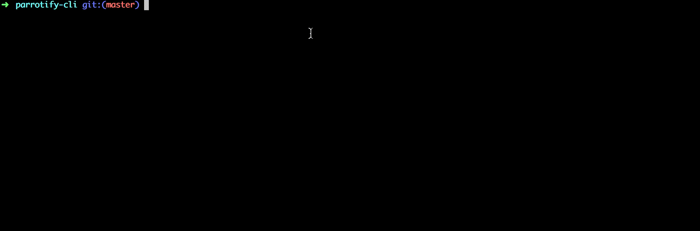

# parrotify-cli

Custom parrots from your command line :tada:



Usage
-----

```
> parrotify [options]


  Options:

    -V, --version                       output the version number
    -b --base [base]                    Base parrot to use
    -o --overlay [overlay]              Image to place on top of the parrot
    -d --delay [delay]                  How hard does the parrot party?
    -h, --help                          output usage information

```

The overlay will autoposition itself based on it's ratio and chosen base (experimental).

TODO
-----

- Fix negative values for posX and posY whenever [this is fixed](https://github.com/tj/commander.js/issues/61)
- Error handling whenever user data is not entered properly (missing overlay and positions defined)
- Give proper default values to positions

-----

Built using [Parrot As A Service](https://github.com/francoislg/PPaaS)

