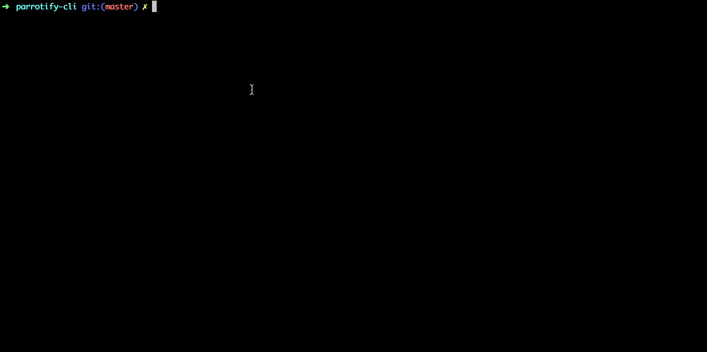

# parrotify-cli

Custom parrots from your command line :tada:



Installation
-----

Requires node > 8

```
npm install -g parrotify-cli
```

Usage
-----

```
> parrotify [options]


  Options:

    -V, --version             output the version number
    -b --base [base]          Base parrot to use
    -o --overlay [overlay]    Image to place on top of the parrot
    -p --position [position]  Position of the overlay (face, hand or hat)
    -d --delay [delay]        How hard does the parrot party?
    -h, --help                output usage information

```

The overlay will autoposition itself based on it's ratio and chosen base (experimental).

A gif file will be generated in the current path showing the result parrot.

TODO
-----

- Error handling whenever user data is not entered properly (missing overlay and positions defined)

- Give an error when node version < 8

-----

Built using [Parrot As A Service](https://github.com/francoislg/PPaaS)

